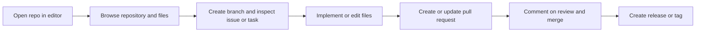

# Envisioning: Forgejo MCP Server for GitHub Copilot

> Status: In Discovery  
> Last updated: 2026-08-29  
> Version: 1.0

---

## 1. Client Context

### 1.1 Direct Client

| Aspect | Information |
|--------|-------------|
| Company/Team | Development teams using Forgejo and GitHub Copilot in VS Code |
| Domain | Software development and platform engineering |
| Team scale | Small to medium engineering teams |
| Channels | IDE integration, local automation, repository operations |

### 1.2 End Client

| Aspect | Information |
|--------|-------------|
| Profile | Software engineers and team leads working in Forgejo-based repositories |
| Volume | Small to large engineering organizations with multiple repositories and contributors |
| Usage context | Developers working in local editors and agentic coding environments |

### 1.3 Additional Context

This project will enable Forgejo repositories to be used with GitHub Copilot-style tooling without forcing teams to switch to GitHub. The direct objective is to expose Forgejo repository operations through a typed API client and an MCP server so Copilot tools can browse repos, read and edit files, manage branches, review issues, create pull requests, and generate releases.

---

## 2. Project Focus

### Prioritized Problem

Teams using Forgejo often have the same development workflows as GitHub users, but they do not have equivalent tool access for AI-assisted coding and automation. This creates friction when using coding agents in editor workflows, especially for issue management, branching, pull requests, and release operations.

| Aspect | Decision |
|--------|----------|
| Chosen focus | Provide a Forgejo-aware MCP server that exposes first-class repository operations to GitHub Copilot and similar agents |
| Justification | Forgejo is API-compatible with many GitHub workflows, but the tooling layer is missing for AI-assisted development |
| Initial scope | Repository browsing, file access, branch operations, pull requests, issues, releases, project metadata |
| Out of initial scope | Full CI/CD orchestration, custom workflow engines, multi-instance federation |

---

## 3. Target Users

### 3.1 Platform Engineering and Dev Teams

Teams operating self-hosted Git services and wanting to integrate AI-assisted software delivery into their normal Forgejo workflow.

Key needs:
- Secure access to repository data and operations
- predictable branching and PR workflows
- compatibility with local AI coding assistants
- practical automation for code review and release flow

### 3.2 Maintainers and Operators

Repository admins and platform owners who need safe, observable access to repository operations.

Key needs:
- scoped authorization and controlled operations
- auditable actions and release automation
- standard repository workflows without custom scripting

---

## 4. Diagnosis: Known Pain Points

### 4.1 Business Pain Points

| Problem | Impact | Source |
|---------|--------|--------| |
| Forgejo workflows are harder to automate in AI-assisted coding environments | Slower developer onboarding and lower productivity | Product gap |
| Repository operations are fragmented across manual UI and custom scripts | Increased operational overhead and risk of inconsistency | Team workflow analysis |
| PR and issue coordination is less discoverable for Copilot-driven assistance | Delayed collaboration and slower delivery | Adoption requirement |

Main impact area:
- [x] End user experience
- [x] Internal operations
- [x] Costs/efficiency
- [x] Growth/scalability
- [x] Multiple areas

### 4.2 Technical Pain Points

| Category | Problem | Impact |
|----------|---------|--------|
| Integration | Forgejo APIs are not wrapped in a typed, reusable client for AI tools | Hard to build reliable automation |
| Agility | Manual repository operations slow development and review cycles | Lower throughput |
| Observability | Repository actions often lack structured visibility for debugging and review | Harder troubleshooting |
| Maintainability | Ad hoc scripts and custom wrappers create duplicate logic | More drift and higher cost |
| Security | AI agents need controlled, scoped access to repositories and metadata | Risk of over-broad permissions |

---

## 5. User Journey

The primary journey is an agent-assisted engineering workflow that begins with repository context and ends with a reviewable change ready for merge.

---

## 6. Strategic Goals

### Business Goal

Enable Forgejo-based teams to use GitHub Copilot-style repository tooling without leaving their existing Git hosting platform. This should reduce friction in coding, review, and release workflows while maintaining platform control and self-hosted flexibility.

### Technical Goal

Build a .NET-based Forgejo MCP server backed by a Kiota-generated client, exposing a stable tool surface for Copilot and other MCP clients. The architecture should support repository browsing, file operations, branch management, pull requests, issues, comments, and releases through a typed, tested API layer.

### Success KPIs

- Repository operations available to Copilot within a local editor workflow
- developers can create and merge PRs without leaving the IDE
- issue and release workflows are supported through structured MCP tools
- the server supports secure, scoped access patterns for self-hosted Forgejo deployments

---

## 7. Constraints and Considerations

- Self-hosted Forgejo deployments vary in configuration and versioning.
- The solution should prioritize secure, explicitly configured access rather than broad automation.
- This project should remain aligned with GitHub Copilot MCP patterns while respecting Forgejo-specific APIs.
- The initial implementation should focus on the highest-value repository workflows first.
